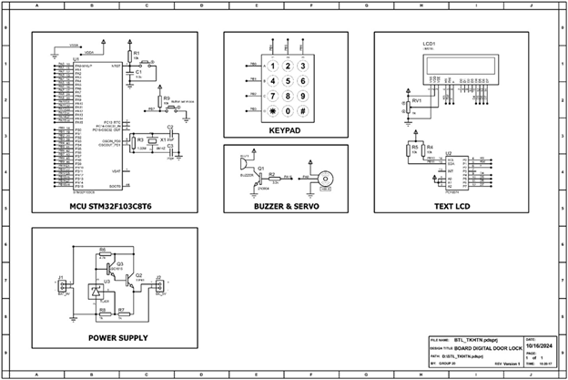
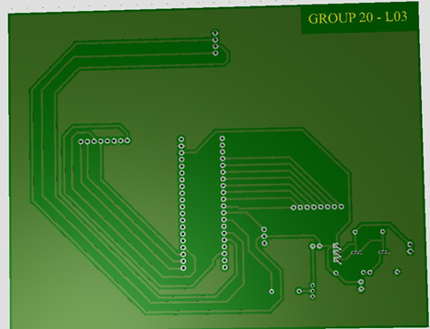

# Project: Digital door lock
This project was conducted on STM32F103 Microcontroller, using other interfaces such as:
* **Keypad**
* **RFID**
* **LCD srceen display 16x2**
* **Servo**
* **Buzzer**

This project has been programmed and developed on STMCUBE also compile with KeilC IDE.
# Product demonstration
  **Schematic view:**
  
  **PCB design:**
  
 **Product view:**
   **PCB front**
     
   **PCB back:
     
