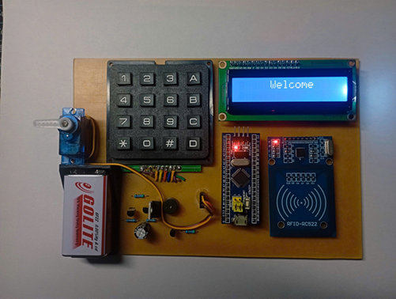
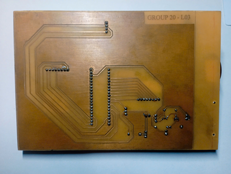

# Project: Digital door lock
This project was conducted on **STM32F103** Microcontroller, along with the following interfaces:
* **Keypad**
* **RFID**
* **LCD srceen display 16x2**
* **Servo**
* **Buzzer**

This project has been programmed and developed on **STMCUBE**, and compiled with **Keil C IDE**.
# Product demonstration  
  **Schematic view:**  
  
  **PCB design:**  
  
 **Product view:**  
   **PCB front:**  
     
   **PCB back:  
     
